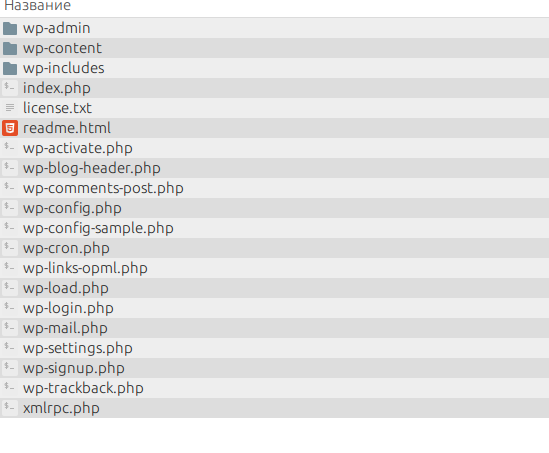

# WordPress


# Архитектура

WordPress - типичная CMS из большой тройки, написана на PHP

Основной сайт - [Wordpress.org](https://wordpress.org/)

Архитектурно делится на следующие части:
- Ядро (/wp-includes и пр.файлы)
- Backend - административную часть (/wp-admin)
- Frontend - внешняя/визуальная часть (/wp-content)

рис.1 - **Структура папок**



---

### Ключевые файлы

**wp-config.php** (конфигурация)

Основной файл определяющий главные настройки работы CMS и файловую структуру WordPress-сайта

- подключение к базе данных
- путь к ключевым папкам WP
- WordPress константы

[Документация](https://codex.wordpress.org/Editing_wp-config.php)

[Генератор](https://generatewp.com/wp-config/)

---

**functions.php** - основной файл темы

Определеяет основные настройки темы WordPress, содержить PHP-функции необходимые для правильной работы темы и подключения необходимых файлов стилей и скриптов

--

# Базовые типы контента

- Post (Post Type: 'post')
- Page (Post Type: 'page')
- Attachments (Post Type: 'attachment')
- Navigation menu (Post Type: 'nav_menu_item')
- Revision
- *Custom CSS (Post Type: 'custom_css')*
- *Changesets (Post Type: 'customize_changeset')*
- *User Data Request (Post Type: 'user_request' )*

WordPress хранит информацию в базе данных - основная таблица с контентом -  `wp_posts`

# Понятие цикла

Цикл - это PHP код для отображения очереди из posts.
```
<?php
get_header();
if (have_posts()) :
   while (have_posts()) :
      the_post();
         the_content();
   endwhile;
endif;
get_sidebar();
get_footer();
?>
```


# Иерархия шаблонов

Позволяет просто и легко кастомизировать/уникализировать отдельные разделы/элементы сайта

Тут схема иерархии шаблонов 

https://wphierarchy.com/

